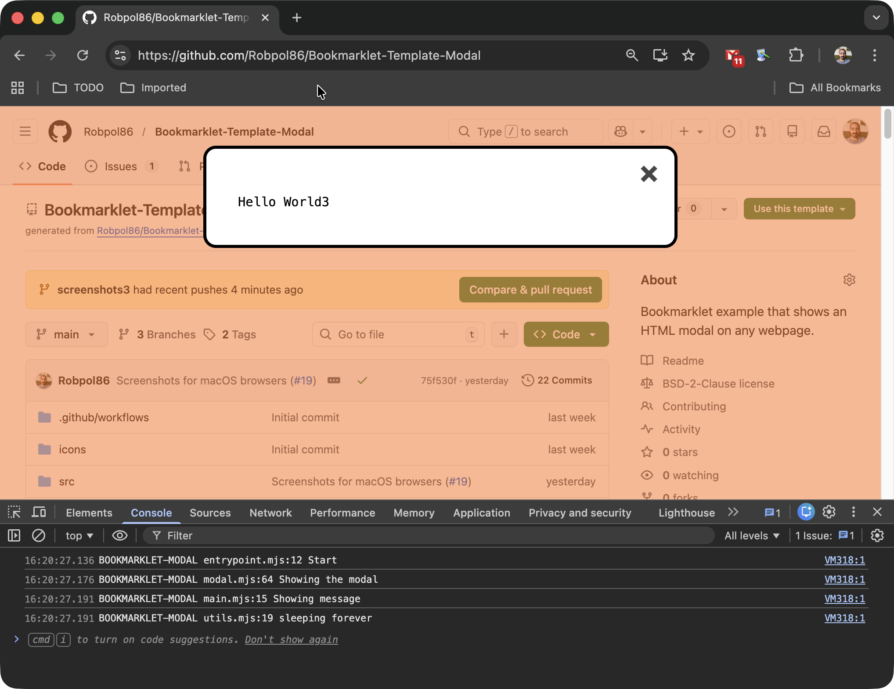
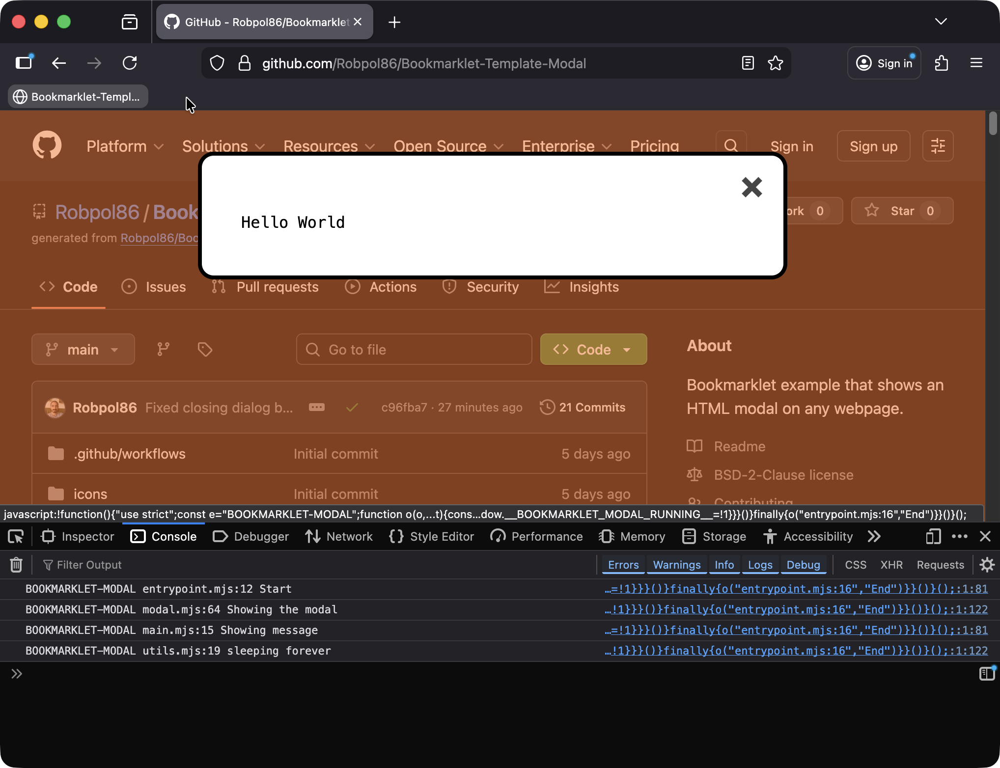
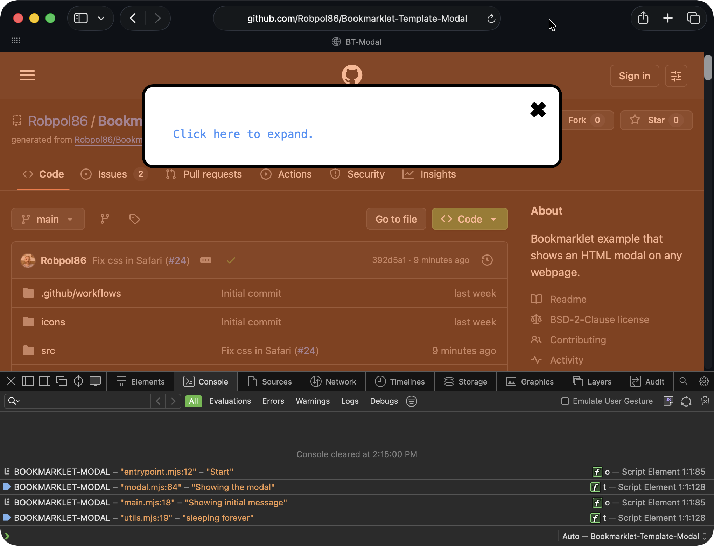
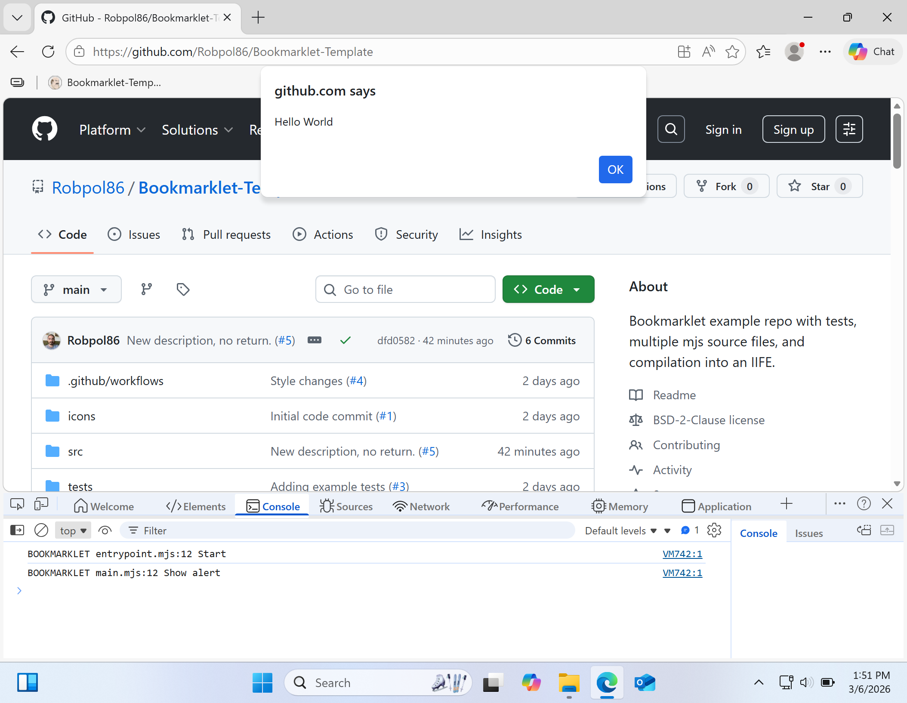
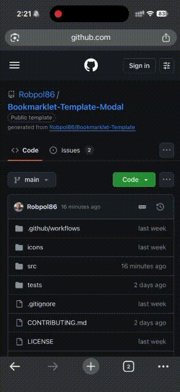
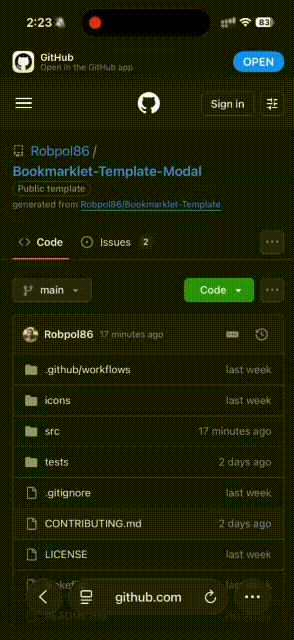
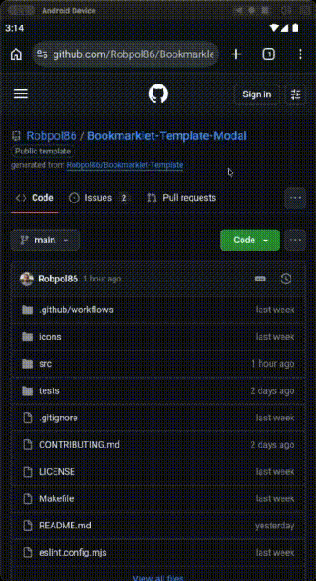
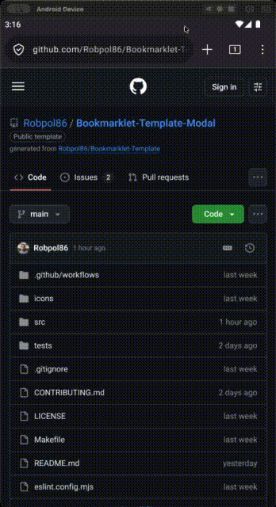

#  Bookmarklet-Template-Modal

Bookmarklet-Template-Modal is an example git repo that includes unit tests, linting, multiple modules (source files), and a
compiler that compiles all modules into a single JavaScript [IIFE](https://developer.mozilla.org/en-US/docs/Glossary/IIFE).
This is how I structure all my one-off [bookmarklets](https://en.wikipedia.org/wiki/Bookmarklet).

<table>
    <tr>
        <td width="50%">
            <div align="center">
                
                <br>
                <em>Used in Chrome on macOS</em>
            </div>
        </td>
        <td width="50%">
            <div align="center">
                
                <br>
                <em>Used in Firefox on macOS</em>
            </div>
        </td>
    </tr>
    <tr>
        <td>
            <div align="center">
                
                <br>
                <em>Used in Safari on macOS</em>
            </div>
        </td>
        <td>
            <div align="center">
                
                <br>
                <em>Used in Edge on Windows 11</em>
            </div>
        </td>
    </tr>
    <tr>
        <td>
            <div align="center">
                
                <br>
                <em>Used in Chrome on iPhone</em>
            </div>
        </td>
        <td>
            <div align="center">
                
                <br>
                <em>Used in Safari on iPhone</em>
            </div>
        </td>
    </tr>
    <tr>
        <td>
            <div align="center">
                
                <br>
                <em>Used in Chrome on Android</em>
            </div>
        </td>
        <td>
            <div align="center">
                
                <br>
                <em>Used in Firefox on Android</em>
            </div>
        </td>
    </tr>
</table>

## Features

Some features I've included in this project are:

* The project's source files are written in
  [JavaScript module files](https://developer.mozilla.org/en-US/docs/Web/JavaScript/Guide/Modules) (*.mjs)
* The project is "compiled" into an [IIFE](https://developer.mozilla.org/en-US/docs/Glossary/IIFE) `javascript:...` "URL"
  using [Terser](https://Terser.org/) and [rollup](https://rollupjs.org/)
    * Terser also minifies the JavaScript
    * The IIFE ensures your bookmarklet code won't conflict with a webpage's code, whilst still giving you access to the
      `document` and `window` objects
* Tests are written for [jest](https://jestjs.io/) and [eslint](https://eslint.org/) is used for linting
* An importable bookmarks HTML file is generated with a favicon for Chrome and Edge so users of those browsers can see an
  icon for your bookmarklet

## Directory Structure

```gap
├─ src/               # All bookmarklet code goes in this directory
│  ├─ main.mjs        # Main file to place your code in
│  ├─ utils.mjs       # Put miscellaneous code here
│  ├─ log.mjs         # Console logging functions
│  ├─ modal.mjs       # Modal functions
│  ├─ modal.scss      # Modal styling
│  └─ entrypoint.mjs  # Tells Terser what to include in the output bookmarklet
│
├─ icons/
│  └─ favicon.png
│
├─ tests/             # Tests are grouped by the file being tested
│  ├─ __mocks__/
│  │  └─ scss.mjs     # Mock styles; needed for tests to run
│  ├─ utils.test.mjs  # Tests for functions in utils.mjs
│  ├─ log.test.js     # Tests for functions in log.mjs
│  └─ modal.test.mjs  # Tests for functions in modal.mjs
│
├─ .github/
│  └─ workflows/
│     ├─ ci.yml
│     └─ release.yml  # Automatically adds compiled JS/HTML files to releases
│
├─ eslint.config.mjs
├─ jest.config.mjs
├─ jest.setup.mjs
└─ rollup.config.mjs  # "Compiler" configuration
```

## Development

For more information on developing a bookmarklet using this repo as a template read the [CONTRIBUTING.md](CONTRIBUTING.md)
document.

## Installing the Bookmarklet

There are three ways to install the bookmarklet:

1. Import the
   [dist/bookmarklet.html](https://github.com/Robpol86/Bookmarklet-Template-Modal/releases/latest/download/bookmarklet.html)
   file using the browser's bookmarks manager (in Chrome and Edge the bookmarklet will have its own favicon)
2. Manually crearte a new bookmark with the contents of
   [dist/bookmarklet.js](https://github.com/Robpol86/Bookmarklet-Template-Modal/releases/latest/download/bookmarklet.js) as
   the URL
3. On a webpage make the bookmarklet an `<a href="...">Bookmarklet</a>` link so the user can drag and drop it into their bookmarks
   bar (replace `...` with the contents of
   [dist/bookmarklet.js](https://github.com/Robpol86/Bookmarklet-Template-Modal/releases/latest/download/bookmarklet.js))
   1. This doesn't work from a GitHub README file


## Usage

Go to any website and click on the bookmarklet in the bookmarks bar (or wherever you've placed it). You should get an alert
that says "Hello World".

## TODO

- Mention based on Lucas Menezes's post: https://dev.to/lucasm/amazing-native-modal-with-just-html-meet-element-4jpl
- Revisit entire README
